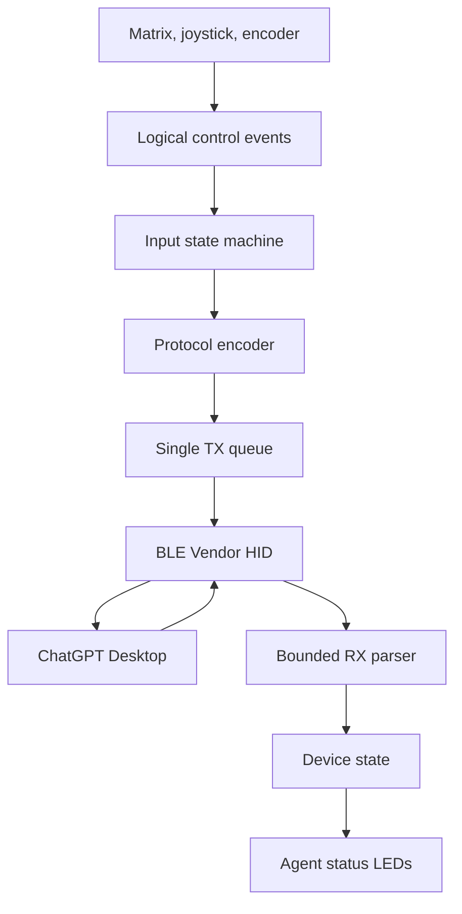

# Firmware architecture

The firmware is a dedicated Zephyr application for XIAO nRF52840. The protocol layer must not depend on the physical key matrix so it can be exercised before the PCB exists.

## Modules

| Module | Responsibility |
| --- | --- |
| `input_matrix` | Scan switches, debounce, emit physical transitions |
| `encoder` | Decode quadrature and press/long-press transitions |
| `joystick` | Resolve digital or analog input into angle/distance events |
| `controls` | Map physical controls to Agent, Command, and encoder identifiers |
| `protocol` | Encode/decode bounded JSON messages and 63-byte framing |
| `transport` | Own BLE HIDS characteristics, bonding, notifications, and writes |
| `device_state` | Store connection, battery, lighting, and host-request state |
| `lighting` | Render six Agent statuses within brightness and power limits |
| `power` | Battery sampling, idle policy, sleep, and wake |

## Concurrency rules

- Only the transport worker writes HID notifications.
- Producers enqueue complete logical messages, not individual fragments.
- BLE callbacks validate and enqueue incoming fragments; JSON parsing runs outside the callback when practical.
- Shared state updates are atomic or guarded by a mutex.
- A disconnect clears transient pressed controls and incomplete RX data.

## Bring-up stages

1. Advertise the observed compatibility identity and establish bonding.
2. Expose Report ID 6 input/output characteristics with the vendor descriptor.
3. Answer `sys.version` and `device.status`.
4. Trigger one Agent and one Command event from a development shell or temporary button.
5. Receive and log sanitized Agent status metadata.
6. Add the physical input matrix, encoder, joystick, battery, and LEDs in that order.

## Compatibility isolation

Keep device identity, HID descriptor bytes, key identifiers, RPC method strings, and default responses in one compatibility module. Host updates should be repairable without touching the matrix and hardware drivers.
